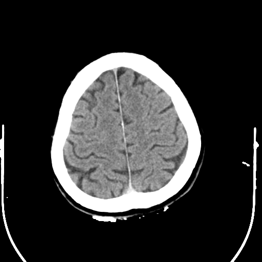
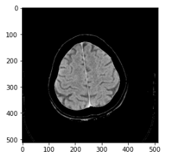
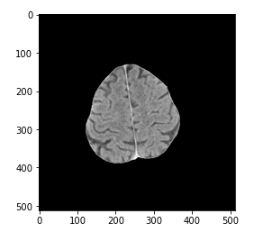
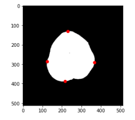
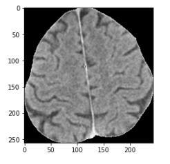

# Can_Portfolio

[# Project 1: Stroke Estimator and Classifier: Project Overview](https://github.com/cankiziloz/Stroke_Estimation.git)

* Creating to estimate of stroke and it's type according to the MRI image slices to be used by authorities as a decision support system.

* Due to the data privacy, the dataset will not be shared. Let's consider the following image.

* First, the most intensive pixels are removed from the image.

* Binary oppening is applied to the images to remove unwanted objects around the brain.

* Some images may also have eye components, so the biggest component is found in the image but this is not the case here.
* The pixels framing the binary image are obtained as shown.

* The image is cropped according the indices of the previous step.

* Currently working on building a proper CNN for this dataset.
